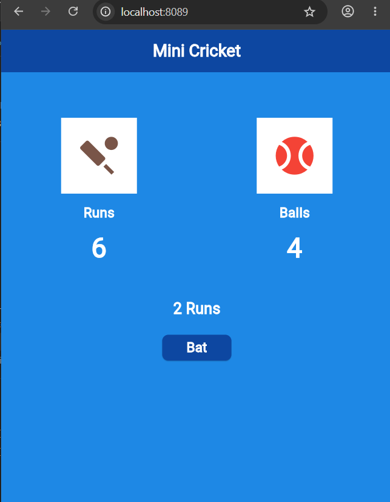

# Mini Cricket App

A simple Flutter application for playing a mini 6-ball cricket game.

## Features
- **Batting & Bowling tracker**: Displays total runs scored and remaining balls out of 6.
- **Interactive Gameplay**: Tap **Bat** to score a random run between 0 and 6.
- **Real-time Action Display**: Displays outcome ("No Runs" or "[X] Runs").
- **Game Restart**: Tap **Restart** when balls reach 0 to play again.

## How to Run

```bash
flutter run -d chrome
```

